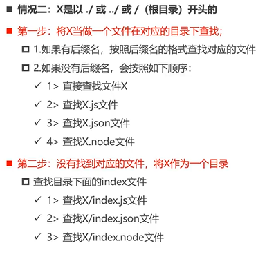

### 1、Node.js的定义：

建立在v8引擎上的js运行时环境


### 2、

(1) V8可以嵌入到C++应用程序中，无论是Chrome还是Node.js，都是嵌入了V8引擎。

(2) Nodejs还有一些额外的操作：文件系统读写、网络IO、加密、压缩解压文件。


### 3、应用场景

(1) 前端开发的库都是以node包的形式进行管理

(2) node -> npm 

(3)  Nodejs可以开发服务器、中间件、代理服务器。

(4) 大量项目需要Nodejs完成前后端渲染

(5) electron需要Nodejs


### 4、环境配置：

(1) 官方网站：nodejs.org，LTS版本(稳定) 

(2)  cmd命令：

```
// 切换盘符：
E:
C: 
D:

// cd 文件路径
cd .. 

// 运行node文件：
node abc.js 
```


### 5、切换Node版本

n / nvm


### 6、Node模块化开发：
(1) 什么是模块化： 把页面分成一个个小小的结构。
(2) 可以导入导出。


### 7、CommonJS的规范 (Node中实现了，浏览器没有实现) 
本质：exports是一个对象，可以通过require进行引用赋值传递。
在进行require的时候会在第一次执行目标js文件，然后会把结果缓存起来，module内部有一个属性会记录当前文件下的module的被加载状态：module.loaded,是一个bool值。

(1) 导出： exports 
exports.x = x 

(2) 导入：require 
require("....") // 导入
const va = require("./")，相当于引用赋值。


### 8、CommonJs: 其它的导出方式： 使用module 
本质：通过require导入的一定是目标js文件的module.exports，当没有进行任何操作时，module.exports === exports，同时指向的都是一个对象的引用，当我们修改了module.exports的时候，exports会被抛弃，将不复存在，require只能指向module.exports。 
module.exports.name = name 
module.exports = {

}

### 9、CommonJs: require相关细节 
require加载过程本质：
当引入模块时，会先进行下面的搜索，紧接着会去找当前路径下的node_modules文件内，然后再按照下面的规则搜索，如果还没有一直往上寻找。




### 10、循环require的时候:
比如aaa关联ccc，ccc关联bbb，多重循环嵌套下，本质上是会用dfs去搜索，遇到flat = 0的就会进行加载，加载过的直接有缓存。

### 11、CommonJs的缺点：不适用于浏览器，服务器一般没有什么影响。
(1) 缺点：加载模块是同步的。
同步意味着对应的模块加载完毕后，当前模块才能被运行，意味着后续的js代码都无法正常运行，即使是一些简单的dom操作。

### 12、ES-module规范
ES6提出的模块化的规范
webpack: 模块化打包工具，在Webpack中，可以混用CommonJs 和 Es-module 
