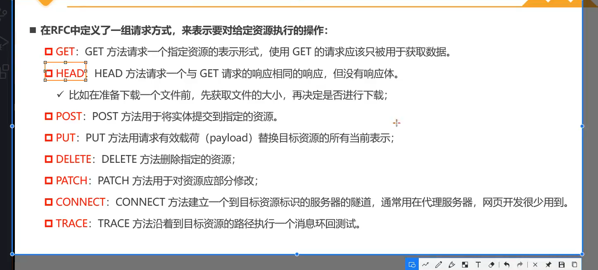

# 网络请求 

1、早期，网页是由服务器端渲染 （SSR）

后端渲染：

2、前后端分离：
(1) 后端负责存储数据，传递数据。
(2) 前端负责处理数据，渲染数据到页面上。

前端渲染：

3、AJAX: 异步的网络请求技术 
(1) 在不重新加载页面的情况下发送请求给服务器 
(2) 接受并且使用从服务器发来的数据 

4、http: 
(1) 应用层协议 
(2) 最早的时候，设计http是为了发布和接收html页面的方法 
(3) 也就是在客户端和服务器建立了一条通道，双方通过http协议进行传递数据。
(4) https就是在http的基础上增加了安全层。
(5) http-request 和 http-response

5、Http请求的组成：
请求信息 + 响应信息
(1) 请求：

(2) 响应：  

6、http的版本：
http 1.1 

7、请求方式：

8、请求头：
(1) content-type: 

(2) keep-alive: 
保持http协议根据tcp协议创建的网络通道 
http1时需要手动开启，1.1默认开启。

(3) accept-encoding: 一般用于请求文件
告知服务器，客户端压缩的文件的格式，比如js文件可以使用gzip，对应.gz文件。

(4) accept: 一般用于请求数据 
告知服务器，客户端可以接受的数据文件的格式类型。

8、响应的状态码：

9、发送AJAX网络请求：
(1) 创建 XMLHttpRequest类。
(2) 监听该对象的变化，或者监听onload事件(请求完成时触发)。
(3) 配置网络请求(open方法) 
(4) 发送(send方法) 

10、XML对象还可以监听的: 
